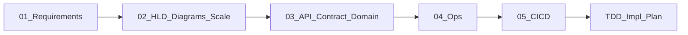

# Production Design Phase (post-requirements)

## Context

Stage 1 is done: [`docs/01-requirements-and-estimation.md`](docs/01-requirements-and-estimation.md). Collinson brief: **TypeScript required**, public GitHub, show reasoning, focused beats exhaustive.

This plan is **Design docs only**. You also want: **how components talk** (PlantUML + sequence diagrams), **API consumer contract** (when it lands), and clarity on **LB / CDN / edge scale** at this stage.

## When does each concern land?

| Concern | Design stage? | Build/implement now? |
|---|---|---|
| Component + sequence diagrams (PlantUML) | **Yes — Doc 02** | N/A (docs); render in README/docs |
| GraphQL **consumer API contract** | **Yes — Doc 03** (before TDD/code) | Implement schema in Code stage |
| Load balancer | **Document** in scale posture (Doc 02) | **No** — platform provides it when you add a 2nd replica; not something you code |
| CDN | **Document as not needed** | **No** — backend GraphQL JSON API; CDN helps static/frontend assets, not this exercise |
| Multi-region / WAF / API gateway | Mention as future if asked | **No** for take-home |
| GitHub Actions CI + Docker | Design in Doc 05 | Implement in Code stage |

**Lead judgement:** design *for* horizontal scale on paper; ship a single-node Compose stack that stays compatible with LB + N replicas. Do not provision AWS ALB/CloudFront in the submission unless you have spare time after a working service.

### Load balancers — needed in design, not in v1 infra

- **Design:** show Client → LB → API replicas → Postgres in the deployment PlantUML; state “any L4/L7 LB (cloud LB, nginx, Traefik)”.
- **v1 run:** one API container; LB appears when replica count > 1.
- **Requirement on the app:** stay **stateless** (no sticky sessions, no local-only truth) so an LB can be dropped in later with zero redesign.

### CDN — not needed at this stage

- No frontend, no large static assets, responses are small GraphQL payloads (~2 KB from `01`).
- Caching belongs in **app/DB freshness** (6h refresh + optional Redis), not CDN edge caches (GraphQL POSTs are poorly CDN-cached anyway).
- One line in Doc 02: “CDN deferred / N/A for backend-only GraphQL.”

## Locked design stance (unchanged core)

- **Modular monolith** (not microservices); optional later split of `api` vs `worker` processes
- **Containers** (not serverless)
- **PostgreSQL** + Prisma; in-memory cache v1 → Redis on scale trigger
- **TypeScript** + Apollo Server + Open-Meteo client with retry/circuit breaker
- **Scale ladder:** API replicas → PgBouncer/read replica → worker queue → Redis → advisory lock for multi-worker

## Diagrams (PlantUML) — how systems talk

All diagrams live under `docs/diagrams/*.puml` and are embedded (or linked) from Doc 02. Prefer **PlantUML** as requested; mermaid only if a quick inline sketch helps.

### Component / deployment (Doc 02)

1. **Context** — Client, Activity Ranking Service, Open-Meteo, Postgres
2. **Containers** — API process, Worker process (same image), Postgres, (future) LB + Redis
3. **Modules** — `graphql` ↔ `scoring` ↔ `store` ↔ `refresh` ↔ `open-meteo` / `geocoding` (internal calls vs network)

### Sequence diagrams (Doc 02) — required flows

1. **Happy-path query** — Client → GraphQL → Store → Scorer → response (with `lastUpdated` / `dataAge`)
2. **Cold-start** — miss in Store → bounded Open-Meteo fetch → upsert → score → response (FR-U4)
3. **Scheduled refresh** — Worker → list locations → Open-Meteo → idempotent upserts → (optional) precompute scores
4. **Provider down** — Client query → Store last-known-good → response with `stale: true` (no hard fail)
5. **Ambiguous geocode** — name → geocode → best match + alternatives in payload

These prove “how parts talk” better than prose alone—exactly what a senior design review expects.

## API consumer contract — when and what

**When:** Design Doc **03**, immediately after HLD, **before** TDD/code. The brief’s “how to consume this” is the GraphQL contract; reviewers (and a future client) need it frozen early.

**What Doc 03 includes (consumer-facing):**

- Endpoint: `POST /graphql` (and health `GET /health`)
- Full GraphQL schema (SDL)
- Example operations: by city name, by lat/lon, expected ranking shape
- Error / ambiguity semantics (GraphQL errors vs soft alternatives)
- Freshness fields every consumer must handle (`lastUpdated`, `dataAge`, `stale`)
- Non-goals for consumers: no auth headers in v1; note where API key middleware would plug in later (`01` NFR)

**Also in Doc 03 (internal):** relational data model, scoring rubric version — not for external clients, but needed so the API stays honest.

README later will point at Doc 03 + one copy-pasteable query for “how to run and call it.”

## Design-phase deliverables

### Doc 02 — HLD, PlantUML, scale, ADRs
[`docs/02-system-design.md`](docs/02-system-design.md) + [`docs/diagrams/`](docs/diagrams/)

- Stack ADRs (monolith, containers, Postgres, no CDN, LB as scale add-on)
- Scale ladder + “design for horizontal scale / ship single instance”
- PlantUML component + deployment + sequences listed above

### Doc 03 — API contract + domain
[`docs/03-api-and-domain-design.md`](docs/03-api-and-domain-design.md)

- Consumer GraphQL contract (schema, examples, freshness/error rules)
- Data model + upsert keys
- Versioned scoring rubric

### Doc 04 — Ops / failure modes
[`docs/04-operations-and-failure-modes.md`](docs/04-operations-and-failure-modes.md)

### Doc 05 — CI/CD
[`docs/05-cicd-and-delivery.md`](docs/05-cicd-and-delivery.md) — GHA lint/typecheck/test/build; Compose; Dockerfile

Amend `01`: TypeScript constraint; Next → `02`–`05`.

## After design approval

TDD plan → Code (including `.puml` kept as source of truth; implement schema from Doc 03) → README.

## Success criteria for design done

- PlantUML shows every major interaction (query, cold-start, refresh, degraded)
- A client engineer can call the API from Doc 03 alone (schema + examples)
- LB is in the deployment picture; CDN explicitly out of scope with reason
- Scale ladder explains growth without building cloud edge infra in the take-home
- Tech ADRs + CI/CD shape ready for implementation
