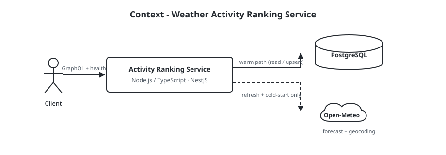
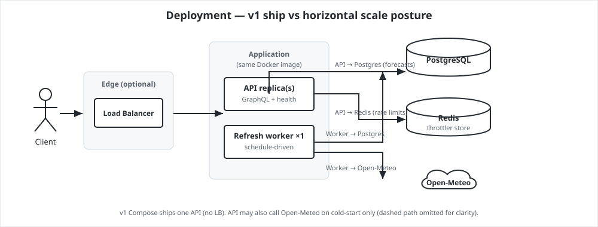
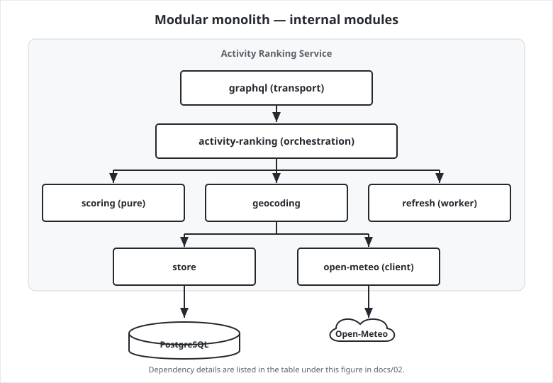
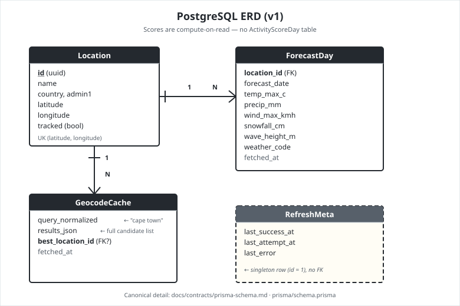
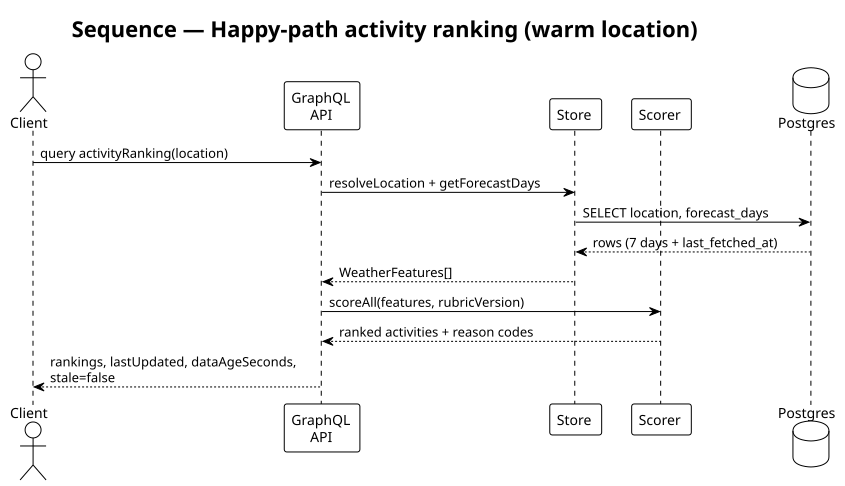
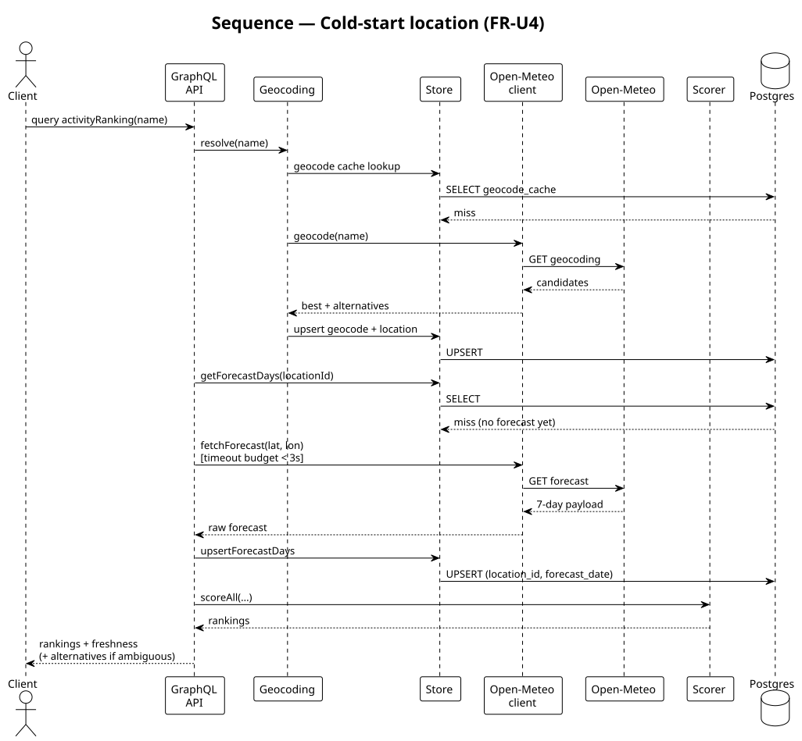
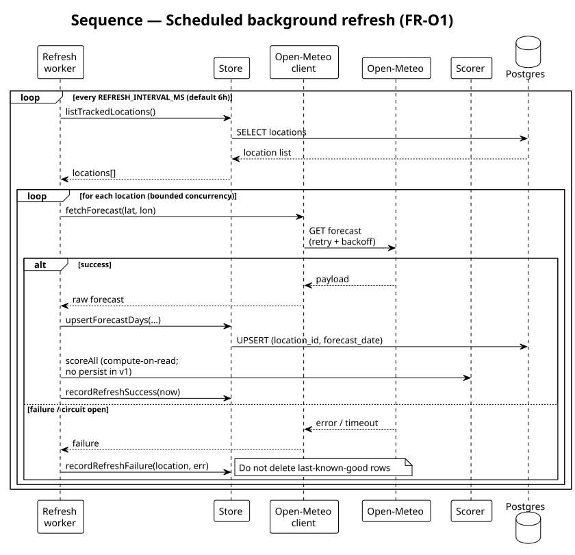
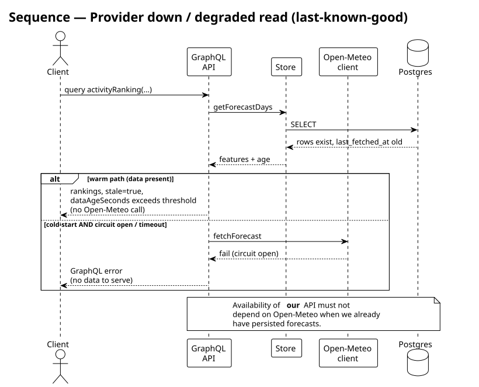
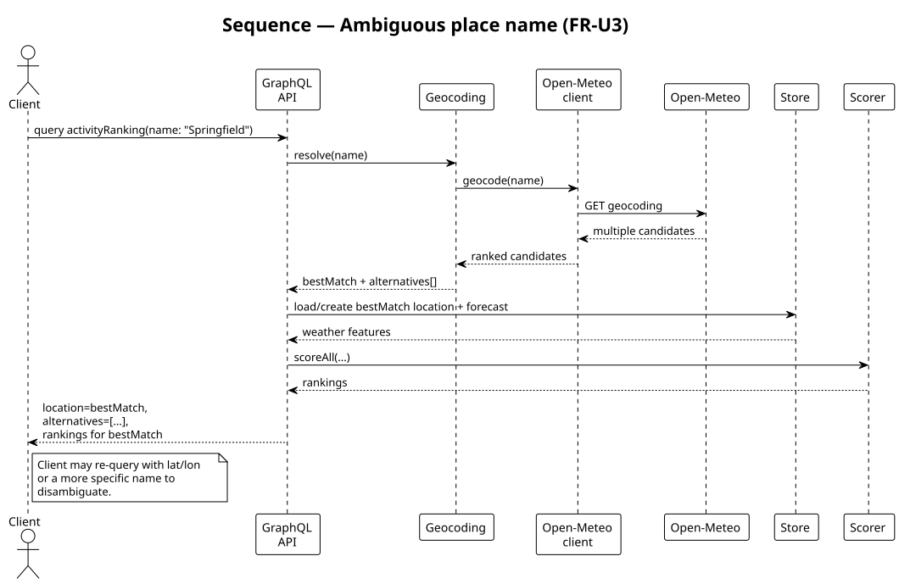

# 02 - System Design (HLD, Scale, Technology ADRs)

**Stage 2 of 5: Clarify → Design → Implementation notes → Code → Review**

High-level architecture, how components talk (SVG diagrams in §2.1), horizontal scale posture, and locked technology decisions. API consumer contract and scoring rubric: [`03-api-and-domain-design.md`](03-api-and-domain-design.md). Ops: [`04-operations-and-failure-modes.md`](04-operations-and-failure-modes.md). CI/CD: [`05-cicd-and-delivery.md`](05-cicd-and-delivery.md).

Depends on: [`01-requirements-and-estimation.md`](01-requirements-and-estimation.md).

---

## 1. Design goals

- Satisfy FR/NFR from `01` with production judgement, not platform theatre
- Stay **stateless on the read path** so unknown traffic can be absorbed by **horizontal API replicas**
- Keep Open-Meteo off the hot path (except bounded cold-start)
- Show decisions and rejected alternatives clearly

---

## 2. High-level architecture

**Style: NestJS modular monolith** - one TypeScript codebase, one Docker image, Nest modules aligned to domain seams. Optional second process entrypoint for the refresh worker (same image, different command / Nest context).

```
Client → [LB*] → NestJS GraphQL API → Store (Postgres)
                      ↓
                   Scorer (pure)
Refresh worker (Nest entry) → Open-Meteo → Store (idempotent upserts)
```

\* Load balancer is a **scale add-on**, not part of the v1 take-home provisioned stack.

### 2.1 Diagrams

Diagrams below are **committed SVG images** (they render on GitHub). Sequence diagrams are generated from PlantUML; architecture diagrams are hand-authored SVGs for clear spacing.

#### Context



Warm path is Postgres-only. Open-Meteo is used for scheduled refresh and bounded cold-start only.

#### Deployment



- Optional LB → API replicas + one refresh worker (same Docker image)
- API → Postgres (forecasts) and Redis (shared rate limits; ADR-005b)
- Worker → Postgres (upserts) and Open-Meteo (schedule refresh)
- v1 Compose: one API, no LB; forecast cache stays in-process (ADR-005a)

#### Modules



| From | Uses |
|---|---|
| `graphql` | `activity-ranking` (transport / error mapping only) |
| `activity-ranking` | `scoring`, `geocoding`, `store`, `open-meteo` (cold-start) |
| `geocoding` | `store` (cache), `open-meteo` (miss) |
| `refresh` | `store` (tracked locations + upserts), `open-meteo` (forecast fetch) |
| `store` | PostgreSQL via Prisma |
| `open-meteo` | Open-Meteo HTTP |

`scoring` is pure/deterministic (compute-on-read; no score table).

#### Database (ERD)



Four PostgreSQL tables. **`Location`** is the hub; scores are **compute-on-read** (no score table).

```
┌─────────────────┐       ┌──────────────────┐
│    Location     │───1:N─│   ForecastDay    │
└────────┬────────┘       └──────────────────┘
         │
         └────1:N──┌──────────────────┐
                   │  GeocodeCache    │
                   └──────────────────┘

┌──────────────────┐
│   RefreshMeta    │  ← singleton (id = 1), no FK
└──────────────────┘
```

| Entity | Role | Relationship |
|---|---|---|
| `Location` | Canonical place (name, lat/lon, `tracked` flag) | Parent of forecasts and geocode best-match pointers |
| `ForecastDay` | Raw Open-Meteo features for one calendar day | **1:N** from `Location` via `location_id` (cascade delete); upsert key `(location_id, forecast_date)` |
| `GeocodeCache` | Cached geocode results for a normalized query (e.g. `"cape town"`) | **1:N** from `Location` via optional `best_location_id` |
| `RefreshMeta` | Worker heartbeat (`last_success_at`, `last_error`, …) | Standalone singleton row — no foreign keys |

Full field list and Prisma SoT: [`contracts/prisma-schema.md`](contracts/prisma-schema.md).

#### Happy-path query (warm)



Warm read path - Postgres only.

#### Cold-start



FR-U4 - bounded Open-Meteo fetch for a new location.

#### Scheduled refresh



FR-O1 / FR-S3 - background worker upserts.

#### Provider down



Last-known-good with `stale: true`. Our API availability must not depend on Open-Meteo when forecasts are already persisted.

#### Ambiguous geocode



FR-U3 - best match plus alternatives. Client may re-query with lat/lon or a more specific name.

### 2.2 Module responsibilities (Nest modules)

| Nest module / area | Responsibility | Depends on |
|---|---|---|
| `GraphqlModule` / resolvers | Schema, resolvers, input validation, response shaping | Store, Scoring, Geocoding |
| `ScoringModule` | Pure, versioned activity scores from weather features | none (no I/O) |
| `StoreModule` (Prisma) | Postgres access, upserts, geocode cache, refresh metadata | Prisma / Postgres |
| `RefreshModule` | Scheduled fetch loop, concurrency limits, outcome logging | Store, OpenMeteo, Scoring |
| `OpenMeteoModule` | HTTP client, retry/backoff, circuit breaker | Open-Meteo |
| `GeocodingModule` | Name → candidates; cache via store | Store, OpenMeteo |
| `HealthModule` | `GET /health` | Store / RefreshMeta |
| `ConfigModule` | Env (`REFRESH_INTERVAL_MS`, timeouts, etc.) | - |

---

## 3. Request vs write paths

| Path | Trigger | Touches Open-Meteo? | Latency SLO |
|---|---|---|---|
| **Warm GraphQL read** | Client query | No | < 300ms p95 |
| **Cold-start read** | First seen location / empty forecast | Yes (bounded) | < 3s with timeout |
| **Background refresh** | Timer (`REFRESH_INTERVAL_MS`, default `21600000` = 6h) | Yes | None user-facing |

Reads and writes are causally independent (`01` §6): user QPS does not drive Open-Meteo load; a slow refresh does not block warm reads.

---

## 4. Horizontal scaling & edge posture

Traffic is **unknown**. We design for scale without building unused infra.

Assumption to state: design envelope includes **~10M requests/day** (order-of-magnitude). That is still horizontal Nest API replicas + Postgres - not a reason to start with microservices or serverless.

### 4.1 Scale ladder

| Signal | Action | Build in take-home? |
|---|---|---|
| API p95 / QPS rising | Add **stateless API replicas** behind an LB | Design yes; ship 1 replica |
| DB connections / CPU | Connection pooling → PgBouncer → read replica | Document only |
| Refresh lag / rate limits | Lower worker concurrency or interval; later queue (BullMQ/SQS) | Config knobs yes; queue later |
| Multi-worker double-refresh | Postgres advisory lock or single leader | Document trigger |
| Forecast cache miss storms across replicas | Shared forecast cache (Redis/etc.) | In-process TTL cache in v1 |
| Multi-region / WAF / API gateway | Platform concern if product needs it | Out of scope |

### 4.2 Load balancer

- **In design:** Client → LB → API replicas (see deployment diagram)
- **In v1:** omitted; one API process is enough for the exercise
- **App constraint:** no sticky sessions, no local disk as source of truth, cache is best-effort TTL only

Any L4/L7 LB works (cloud LB, nginx, Traefik) - we do not lock a vendor.

### 4.3 CDN

**Not needed.** Backend-only GraphQL, small JSON payloads (~2 KB), typically `POST /graphql` (poor CDN fit). Freshness is owned by refresh interval + response fields (`lastUpdated`, `dataAgeSeconds`, `stale`), not edge caches.

### 4.4 What we ship vs what we design for

| Concern | Design | Implement in submission |
|---|---|---|
| Stateless API | Yes | Yes |
| Single Postgres primary | Yes | Yes (Compose) |
| LB + N replicas | Yes (diagram + ladder) | No (one API container) |
| CDN | Explicitly N/A | No |
| Forecast cache | In-process TTL | Yes (per API instance) |
| Redis (throttler store) | Shared rate limits | Yes (Compose; required in production) |
| Microservices | Rejected | No |

---

## 5. Technology ADRs

### ADR-001 - NestJS modular monolith (not microservices)

- **Decision:** One NestJS deployable with domain modules; optional `api` / `worker` process split via entrypoint (`main.ts` vs `worker.ts`).
- **Why:** Clear module seams and a single deployable keep the system reviewable; unknown→~10M req/day still doesn’t justify a service mesh. Module boundaries preserve a future extract of the worker.
- **Rejected:** Microservices per activity or separate geocode/forecast services - premature.
- **Scale trigger:** Split worker deploy when refresh cadence or resource profile diverges from API.

### ADR-002 - Containers, not serverless

- **Decision:** Multi-stage Docker image + Compose for local; container-ready for Fly/Render/ECS-style hosts.
- **Why:** Long-running GraphQL process + scheduled refresh with concurrency control fit containers. Serverless max duration, cold starts, and cron/worker patterns fight this workload.
- **Rejected:** AWS Lambda / Cloud Functions as primary runtime.
- **Cut:** No Terraform/CloudFormation in v1 unless spare time after a working service.

### ADR-003 - PostgreSQL + Prisma

- **Decision:** PostgreSQL as system of record; Prisma for schema migrations and typed access.
- **Why:** Idempotent upserts on `(location_id, forecast_date)`; multi-replica API needs a real server DB (SQLite single-writer fights horizontal scale); schema clarity for reviewers; volume from `01` is tiny - Postgres is chosen for **integrity and scale headroom**, not size.
- **Rejected:** SQLite as primary; DynamoDB/NoSQL (weaker fit for relational forecast rows + upserts in this exercise).
- **Scale trigger:** PgBouncer / read replicas when DB - not the app - is the bottleneck.

### ADR-004 - NestJS + GraphQL (Apollo driver) on TypeScript/Node

- **Decision:** **NestJS** modular monolith with GraphQL via the **Apollo driver** (`@nestjs/graphql` + `@nestjs/apollo`). Schema-first: load SDL from `docs/contracts/schema.graphql`. TypeScript (brief mandate).
- **Why:** NestJS gives modular structure, DI, and providers suited to a production-shaped TypeScript service. Nest does **not** replace the scale design; it hosts the same stateless API + worker seams. GraphQL remains the brief-mandated API style; Apollo is the GraphQL engine under Nest.
- **Rejected:** Standalone Apollo Server without Nest (weaker module/DI structure for this size); REST wrapper “plus GraphQL later”; gRPC (out of brief).
- **Scale note:** Target planning envelope ~**10M requests/day** (~100-250 avg QPS, ~1k peak with burst) still means **horizontal Nest API replicas + Postgres**, not microservices. Nest modules ≠ distributed services.
- **Worker:** Separate Nest application context / entrypoint (`worker.ts`) with schedule or interval provider - same Docker image, different command - so refresh stays decoupled from request threads.

### ADR-005a - In-process forecast cache

- **Decision:** Short-TTL in-memory cache for hot locations on each API instance (`FORECAST_CACHE_TTL_MS`, default 60s). **Status: implemented.**
- **Why:** Hot set ~500 KB (`01`); 6h data change rate; single/few replicas make a shared forecast cache optional.
- **Rejected:** Shared Redis/Memcached for forecast payloads in v1 (ops cost without proven stampede).
- **Scale trigger:** Shared forecast cache when replica count causes stampede or uneven hit rates.

### ADR-005b - Redis for shared rate-limit storage

- **Decision:** Nest throttler uses Redis when `REDIS_URL` is set; **required when `NODE_ENV=production`**. Compose ships a `redis` service for local demo. **Status: implemented.**
- **Why:** Stateless API replicas need a shared limit store so clients cannot bypass throttling by hitting different instances; fail-closed on Redis errors.
- **Rejected:** In-process-only throttling for production (broken under horizontal scale).
- **Note:** This Redis role is **rate limiting only**, not the forecast cache (ADR-005a).

### ADR-006 - Refresh scheduling in-worker

- **Decision:** Interval inside the worker process; `REFRESH_INTERVAL_MS` env config in milliseconds (FR-O2). Default `21600000` (6 hours). Cross-process leadership via `pg_try_advisory_lock`. **Status: implemented.**
- **Why:** Simplest decoupled refresh; lock prevents double-fetch when scaled.
- **Rejected:** External cron hitting an HTTP “refresh all” endpoint as the only mechanism (harder to bound concurrency).
- **Scale trigger:** Queue if lock contention or multi-region workers are required.

### DIP note (repositories)

- Concrete Nest repository classes are injected directly (no port interfaces). Acceptable modular-monolith idiom at this size; introduce tokens/interfaces if a second store adapter appears.

---

## 6. Locked stack summary

| Layer | Choice |
|---|---|
| Language | TypeScript on Node.js |
| API | NestJS + GraphQL (Apollo driver), schema-first SDL |
| Persistence | PostgreSQL + Prisma |
| Weather | Open-Meteo (forecast + geocoding) |
| Runtime shape | Nest modular monolith, Docker (`api` + `worker` entrypoints) |
| Cache (v1) | In-process TTL |
| CI | GitHub Actions (see `05`) |

---

## 7. Mapping to requirements

| Requirement | Design answer |
|---|---|
| FR-S1 / warm path | Store is source of truth; diagrams `seq-happy-path` |
| FR-U4 cold-start | Bounded Open-Meteo on miss; `seq-cold-start` |
| FR-O1 refresh | Worker process; `seq-refresh` |
| FR-S3 idempotent writes | Upsert key `(location_id, forecast_date)` |
| Availability NFR | Last-known-good + `stale`; `seq-provider-down` |
| Scalability NFR | Stateless API + scale ladder |
| Testability NFR | Pure `scoring` module |

---

## 8. Next

→ [`03-api-and-domain-design.md`](03-api-and-domain-design.md) - consumer GraphQL contract, data model, scoring rubric.

Doc index: [`README.md`](README.md).
