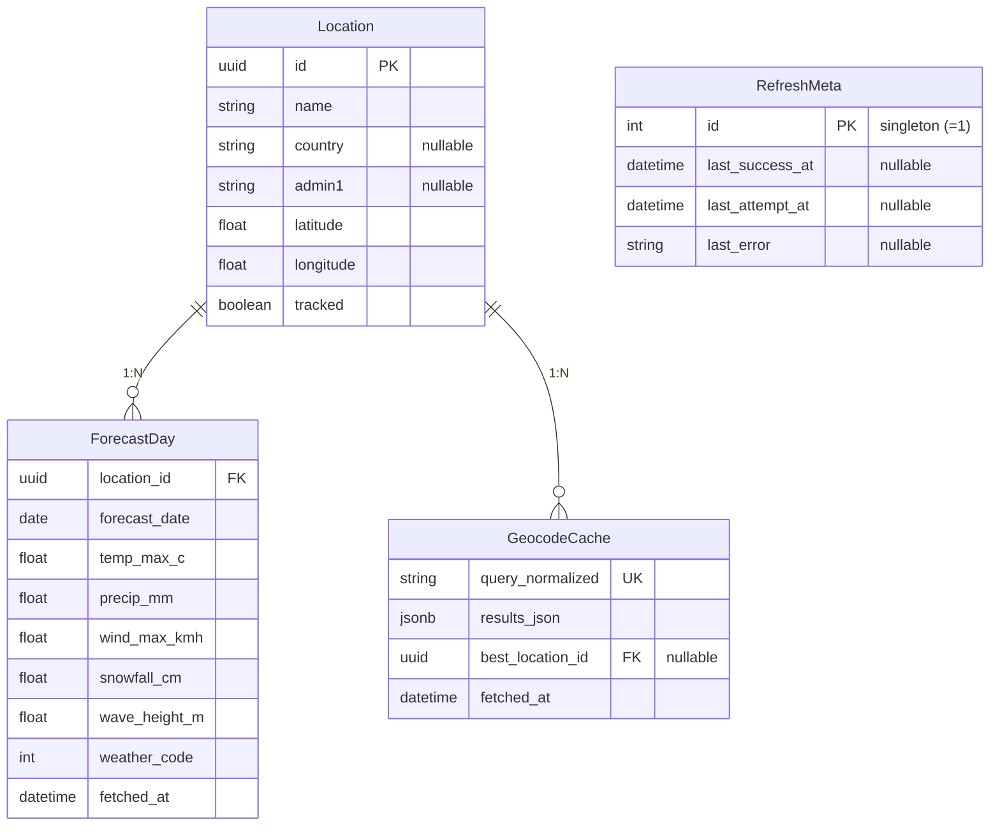

# Prisma database design (v1)

Implemented in [`prisma/schema.prisma`](../../prisma/schema.prisma). `DATABASE_URL` is configured via [`prisma.config.ts`](../../prisma.config.ts) (Prisma 7 - not in the datasource block).

**Policies**

- Current 7-day forecast window only (no history table)
- Scores are **compute-on-read** via pure scorer - no `ActivityScoreDay` table in v1
- Idempotent upsert key: `ForecastDay @@unique([locationId, forecastDate])` (FR-S3)

## ER overview


Also linked from [system design §2.1](../02-system-design.md#21-diagrams).



**Layout (same relationships as the SVG):**

```
┌─────────────────┐       ┌──────────────────┐
│    Location     │───1:N─│   ForecastDay    │
└────────┬────────┘       └──────────────────┘
         │
         └────1:N──┌──────────────────┐
                   │  GeocodeCache    │
                   └──────────────────┘

┌──────────────────┐
│   RefreshMeta    │  ← singleton (id = 1), no FK
└──────────────────┘
```

### Entity summary

| Table | Key fields | Relationship |
|---|---|---|
| `Location` | `id`, `name`, `latitude`, `longitude`, `tracked` | Hub — parent of forecasts and geocode best-match pointers |
| `ForecastDay` | `location_id`, `forecast_date`, weather features | **1:N** from `Location`; UK `(location_id, forecast_date)`; ON DELETE CASCADE |
| `GeocodeCache` | `query_normalized`, `results_json`, `best_location_id` | **1:N** from `Location` via optional `best_location_id` |
| `RefreshMeta` | `last_success_at`, `last_attempt_at`, `last_error` | Singleton (`id = 1`); no FK to other tables |

## Exact Prisma schema

```prisma
generator client {
  provider = "prisma-client-js"
}

datasource db {
  provider = "postgresql"
}

model Location {
  id        String   @id @default(uuid()) @db.Uuid
  name      String
  country   String?
  admin1    String?
  latitude  Float
  longitude Float
  /// When true, the refresh worker includes this location. Selected/primary only.
  tracked   Boolean  @default(false)
  createdAt DateTime @default(now()) @map("created_at")
  updatedAt DateTime @updatedAt @map("updated_at")

  forecastDays ForecastDay[]
  geocodeBestFor GeocodeCache[] @relation("GeocodeBestLocation")

  @@unique([latitude, longitude])
  @@index([tracked])
  @@map("locations")
}

model GeocodeCache {
  id              String   @id @default(uuid()) @db.Uuid
  queryNormalized String   @unique @map("query_normalized")
  resultsJson     Json     @map("results_json")
  bestLocationId  String?  @map("best_location_id") @db.Uuid
  fetchedAt       DateTime @map("fetched_at")

  bestLocation Location? @relation("GeocodeBestLocation", fields: [bestLocationId], references: [id])

  @@map("geocode_cache")
}

model ForecastDay {
  id            String   @id @default(uuid()) @db.Uuid
  locationId    String   @map("location_id") @db.Uuid
  forecastDate  DateTime @map("forecast_date") @db.Date
  tempMaxC      Float?   @map("temp_max_c")
  tempMinC      Float?   @map("temp_min_c")
  precipMm      Float?   @map("precip_mm")
  precipProbPct Float?   @map("precip_prob_pct")
  windMaxKmh    Float?   @map("wind_max_kmh")
  snowfallCm    Float?   @map("snowfall_cm")
  waveHeightM   Float?   @map("wave_height_m")
  weatherCode   Int?     @map("weather_code")
  rawJson       Json?    @map("raw_json")
  fetchedAt     DateTime @map("fetched_at")

  location Location @relation(fields: [locationId], references: [id], onDelete: Cascade)

  @@unique([locationId, forecastDate])
  @@map("forecast_days")
}

/// Singleton row: id must always be 1
model RefreshMeta {
  id            Int       @id
  lastSuccessAt DateTime? @map("last_success_at")
  lastAttemptAt DateTime? @map("last_attempt_at")
  lastError     String?   @map("last_error")

  @@map("refresh_meta")
}
```

## Indexes / notes

- `@@unique([latitude, longitude])` - treat exact floats from geocoder as identity for v1
- `tracked` + `@@index([tracked])` - refresh worker iterates **tracked** locations only
- A location becomes tracked when first successfully resolved via a client query (name-based); coordinate-only lookups do not auto-track
- Cold-start creates/updates the `Location` row before upserting `ForecastDay`
